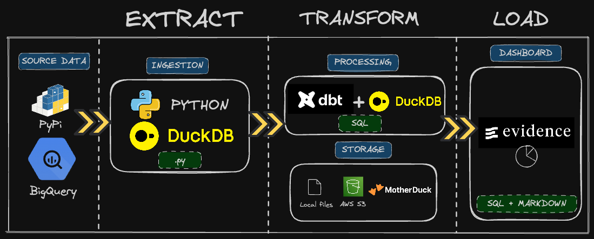

# Pypi Duck Flow : Get insights of your python project 🐍

This project is a collections of pipelines to get insights of your python project. It also serves as educational purpose (YouTube videos and blogs) to learn how to build data pipelines with **Python**, **SQL** & **DuckDB**.
You can see the final result of the project in this live [dashboard](http://duckdbstats.com/).


The project is a monorepo composed of series in 3 parts :
- Ingestion, under `ingestion` folder ([YouTube video](https://youtu.be/3pLKTmdWDXk?si=ZI9fjoGQ7hHzznOZ), [Blog](https://motherduck.com/blog/duckdb-python-e2e-data-engineering-project-part-1/))
- transformation, under `transform` folder ([YouTube video](https://www.youtube.com/watch?v=SpfEQQXBGMQ), [Blog](https://motherduck.com/blog/duckdb-dbt-e2e-data-engineering-project-part-2/))
- Visualization, under `dashboard` folder ([YouTube video](https://youtu.be/ta_Pzc2EEEo))

## High level architecture


## Development

### Setup

The project requires :
* Python 3.11
* Poetry for dependency management.
* Nodejs (only for the visualization part)

There's also two [devcontainers](https://code.visualstudio.com/docs/devcontainers/containers) definitions for VSCode : one for Python, and one for NodeJS.
Finally a `Makefile` is available to run common tasks.

### Env & credentials

A `.env` file is required to run the project. You can copy the `.env.example` file and fill the required values.
```
TABLE_NAME=pypi_file_downloads # output table name
S3_PATH=s3://my-s3-bucket # output s3 path
AWS_PROFILE=default # aws profile to use
GCP_PROJECT=my-gcp-project # GCP project to use
START_DATE=2023-04-01 # start date of the data to ingest
END_DATE=2023-04-03 # end date of the data to ingest
PYPI_PROJECT=duckdb # pypi project to ingest
GOOGLE_APPLICATION_CREDENTIALS=/path/to/my/creds # path to GCP credentials
motherduck_token=123123 # MotherDuck token
TIMESTAMP_COLUMN=timestamp # timestamp column name, use for partitions on S#
DESTINATION=local,s3,md # destinations to push data to, can be one or more
TRANSFORM_S3_PATH_INPUT=s3://my-input-bucket/pypi_file_downloads/*/*/*.parquet # For transform pipeline, input source data
TRANSFORM_S3_PATH_OUTPUT=s3://my-output-bucket/ # For transform pipeline, output source if putting data to s3
```

## Ingestion

### Requirements

- [GCP account](https://console.cloud.google.com/)
- AWS S3 bucket (optional to push data to S3) and AWS credentials (at the default `~/.aws/credentials` path) that has write access to the bucket
- [MotherDuck account](https://app.motherduck.com/) (optional to push data to MotherDuck)

### Run
Once you fill your `.env` file, do the following :
* `make install` : to install the dependencies
* `make pypi-ingest` : to run the ingestion pipeline
* `make pypi-ingest-test` : run the unit tests located in `/ingestion/tests`


## Transformation

### Requirements
You can choose to push the data of the transform pipeline either to AWS S3 or to MotherDuck. Both pipelines rely on source data storing on AWS S3 (see Ingestion section for more details). You can use a public sample dataset for this part of the tutorial, which is located at `s3://us-prd-motherduck-open-datasets/pypi/sample_tutorial/pypi_file_downloads/*/*/*.parquet` 
For AWS S3, you would need : 
- [AWS S3 bucket](https://aws.amazon.com/s3/) 
- AWS credentials (at the default `~/.aws/credentials` path) that has read access to the bucket source bucket and write to the destination bucket
For MotherDuck, you would need: 
- [MotherDuck account](https://app.motherduck.com/) 
- AWS IAM user account with read/write access to the source AWS S3 bucket and write access to the destination AWS S3 bucket

### Run
Fill your `.env` file with the following variables. Note that you can use the TRANSFORM_S3_PATH_INPUT value here below for the tutorial, it's a public bucket containing some sample data: 
```
motherduck_token=123123 
TRANSFORM_S3_PATH_INPUT=s3://us-prd-motherduck-open-datasets/pypi/sample_tutorial/pypi_file_downloads/*/*/*.parquet 
TRANSFORM_S3_PATH_OUTPUT=s3://my-output-bucket/ 
```
You can then run the following commands :
* `make install` : to install the dependencies
* `make pypi-transform START_DATE=2023-04-05 END_DATE=2023-04-07 DBT_TARGET=dev` : example of a run reading from AWS S3 and writing to AWS S3
* `make pypi-transform START_DATE=2023-04-05 END_DATE=2023-04-07 DBT_TARGET=prod` : example of a run reading from AWS S3 and writing to MotherDuck
* `make pypi-transform-test` : run the unit tests located in `/transform/pypi_metrics/tests`

## Visualization - Dashboard

The visualization part is using [Evidence framework](https://evidence.dev/) to create a dashboard. 
It's a NodeJS project that uses the data from the transformation pipeline, stored on [MotherDuck](https://app.motherduck.com/).
You can also use the available MotherDuck [shared database](https://motherduck.com/docs/key-tasks/sharing-data/) (including data from `duckdb` pypi project)

### Accessing the shared MotherDuck database
To access the dataset, you only need to create a free account on [MotherDuck](https://app.motherduck.com/), and then you can access the shared database by using the following `ATTACH` url, to be run in your DuckDB client (Python, CLI, etc.):

```
ATTACH 'md:_share/duckdb_stats/507a3c5f-e611-4899-b858-043ce733b57c'
```

### Running the dashboard
To run the dashboard, you need to have NodeJS installed on your machine.
You can then : 
- Install the dependencies by running `npm install` in the `dashboard` folder.
- Run a local server by running `npm run dev` in the `dashboard` folder.
