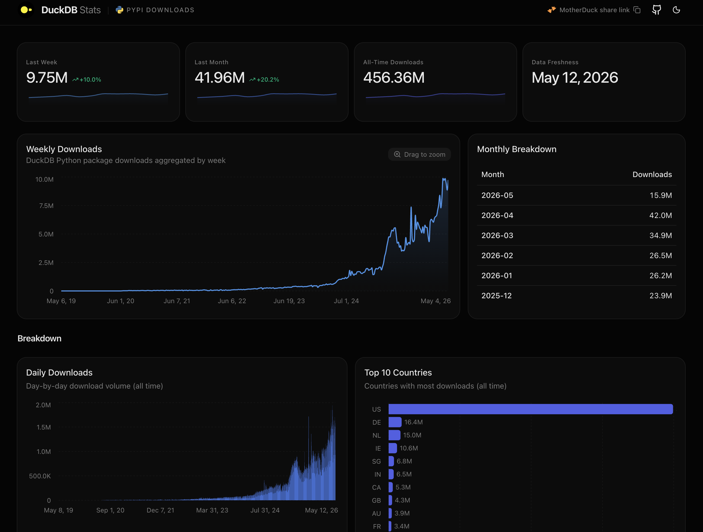
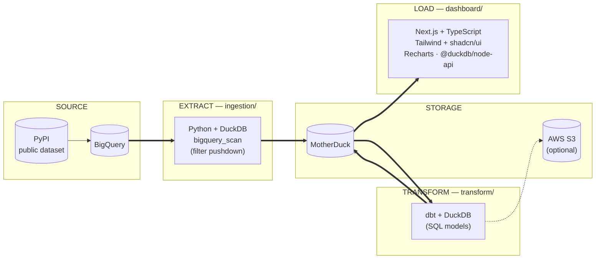

# Pypi Duck Flow : Get insights of your python project 🐍

This project is a collections of pipelines to get insights of your python project. It also serves as educational purpose (YouTube videos and blogs) to learn how to build data pipelines with **Python**, **SQL** & **DuckDB**.
You can see the final result of the project in this live [dashboard](http://duckdbstats.com/).



The project is a monorepo composed of series in 3 parts :
- Ingestion, under `ingestion` folder ([YouTube video](https://youtu.be/3pLKTmdWDXk?si=ZI9fjoGQ7hHzznOZ), [Blog](https://motherduck.com/blog/duckdb-python-e2e-data-engineering-project-part-1/))
- transformation, under `transform` folder ([YouTube video](https://www.youtube.com/watch?v=SpfEQQXBGMQ), [Blog](https://motherduck.com/blog/duckdb-dbt-e2e-data-engineering-project-part-2/))
- Visualization, under `dashboard` folder ([YouTube video](https://youtu.be/ta_Pzc2EEEo), [Blog](https://motherduck.com/blog/duckdb-dashboard-e2e-data-engineering-project-part-3/))

> ⚠️ This project has undergone significant changes since the tutorials were recorded.  
> To follow along with the original tutorial content, please check out the [`feat/tutorial-archive` branch](https://github.com/mehd-io/pypi-duck-flow/tree/feat/tutorial-archive).

You can also refer to the [`CHANGELOG.md`](./CHANGELOG.md) for a complete list of updates.

## High level architecture


```mermaid
flowchart LR
    subgraph SRC["SOURCE"]
        PYPI[("PyPI<br/>public dataset")]
        BQ[("BigQuery")]
        PYPI --> BQ
    end

    subgraph EXTRACT["EXTRACT — ingestion/"]
        ING["Python + DuckDB<br/>bigquery_scan<br/>(filter pushdown)"]
    end

    subgraph TRANSFORM["TRANSFORM — transform/"]
        DBT["dbt + DuckDB<br/>(SQL models)"]
    end

    subgraph STORE["STORAGE"]
        MD[("MotherDuck")]
        S3[("AWS S3<br/>(optional)")]
    end

    subgraph LOAD["LOAD — dashboard/"]
        NEXT["Next.js + TypeScript<br/>Tailwind + shadcn/ui<br/>Recharts · @duckdb/node-api"]
    end

    BQ ==> ING ==> MD
    MD ==> DBT
    DBT ==> MD
    DBT -.-> S3
    MD ==> NEXT
```

## Development

### Setup

The project requires :
* Python 3.12
* uv for python packages.
* Node.js (only for the visualization part)

There's also two [devcontainers](https://code.visualstudio.com/docs/devcontainers/containers) definitions for VSCode : one for Python, and one for NodeJS.
Finally a `Makefile` is available to run common tasks.

### Env & credentials

A `.env` file is required to run the project. You can copy `env.template` and fill the required values.
```
DATABASE_NAME=duckdb_stats # MotherDuck database name
GCP_PROJECT=my-gcp-project # GCP project used as the billing project for bigquery_scan
START_DATE=2023-04-01 # start date of the data to ingest
END_DATE=2023-04-03 # end date of the data to ingest
PYPI_PROJECT=duckdb # pypi project to ingest
GOOGLE_APPLICATION_CREDENTIALS=/path/to/my/creds # path to GCP credentials
motherduck_token=123123 # MotherDuck token (required)
MOTHERDUCK_DATABASE_PATH=_share/duckdb_stats/1eb684bf-faff-4860-8e7d-92af4ff9a410 # dashboard database or share path
TIMESTAMP_COLUMN=timestamp # timestamp column name
TRANSFORM_S3_PATH_OUTPUT=s3://my-output-bucket/ # optional: dbt export target on S3
AWS_PROFILE=default # only used by the `aws-sso-creds` helper
```

## Ingestion

The pipeline reads from the public PyPI BigQuery dataset using the DuckDB [BigQuery community extension](https://duckdb.org/community_extensions/extensions/bigquery.html) (`bigquery_scan` with filter pushdown via the Storage Read API) and writes directly to MotherDuck. SQL-based data quality checks (null-rate thresholds on `timestamp` and `project`) run after each load.

### Requirements

- [GCP account](https://console.cloud.google.com/) with access to the `bigquery-public-data.pypi` dataset (used as the billing project)
- [MotherDuck account](https://app.motherduck.com/) and token

### Run
Once you fill your `.env` file, do the following :
* `make install` : to install the dependencies
* `make pypi-ingest` : to run the ingestion pipeline
* `make pypi-ingest-test` : run the unit tests located in `/ingestion/tests`


## Transformation

The transform layer is a dbt project (`dbt-duckdb`) that reads the raw `pypi_file_downloads` table produced by the ingestion step and builds the downstream models consumed by the dashboard.

### Requirements
- [MotherDuck account](https://app.motherduck.com/) and token — default source (`DBT_DATA_SOURCE=motherduck`) and dbt `prod` target.
- The dbt `dev` target writes to a local DuckDB file at `/tmp/dbt.duckdb` — no MotherDuck connection needed for local iteration on transformed models.
- Optional: an S3 bucket if you want dbt to also export partitioned parquet via `TRANSFORM_S3_PATH_OUTPUT` (the `external_source` data source). For the tutorial flow, a public sample is available at `s3://us-prd-motherduck-open-datasets/pypi/sample_tutorial/pypi_file_downloads/*/*/*.parquet`.

### Run
Make sure `motherduck_token` is set in your `.env`, then:
* `make install` : install the dependencies
* `make pypi-transform START_DATE=2023-04-05 END_DATE=2023-04-07 DBT_TARGET=dev` : run dbt against the local DuckDB file
* `make pypi-transform START_DATE=2023-04-05 END_DATE=2023-04-07 DBT_TARGET=prod` : run dbt against MotherDuck
* `make pypi-transform-test` : run the dbt tests under `/transform/pypi_metrics/tests`

### Preview corrected PyPI download counts

On August 24, 2026, PyPI changed its download-log configuration so that only requests for distribution artifacts ending in `.whl`, `.tar.gz`, or `.zip` are recorded. Earlier data also includes metadata sidecars and other package objects, and PyPI did not rewrite those historical rows. See [Metadata requests no longer tracked in PyPI download counts](https://blog.pypi.org/posts/2026-08-31-download-counts/) on the official PyPI blog for the source and full rationale.

This project applies PyPI's artifact rule to every available historical date rather than scaling or estimating newer values. The transformed model retains both definitions: `daily_download_sum` is the comparable artifact-only metric used by default, while `legacy_daily_download_sum` counts every package-object request present in the source. The dashboard's "Comparable download history" switch changes every KPI, chart, table, and breakdown between these definitions; its information popover also links directly to the PyPI post.

To build the corrected history without re-ingesting BigQuery data, create an empty preview database once with `uv run python -c "import duckdb; duckdb.connect('md:').execute('CREATE DATABASE IF NOT EXISTS duckdb_stats_preview')"`, then run `make pypi-transform-preview`. The preview target reads `pypi_file_downloads` from the public MotherDuck share and writes the transformed model to `duckdb_stats_preview` in your MotherDuck account.

To view that model in the local dashboard, set `MOTHERDUCK_DATABASE_PATH=duckdb_stats_preview` and `MOTHERDUCK_TOKEN`, then start the dashboard with `npm run dev`.

For production rollout, rebuild `pypi_daily_stats` with `--full-refresh` across the complete raw-data range before deploying the dashboard or updating its public MotherDuck share. A normal incremental run cannot safely introduce the second metric column or remove aggregates left behind by the previous definition.

The **PyPI Data Pipeline** GitHub Action provides this as a manual **Full refresh** option. Choose `transform`, enter the earliest available raw date and the day after the latest raw date, then enable **Full refresh**. This skips ingestion, rebuilds the transformed table from the existing MotherDuck raw data, and updates the MotherDuck share after the transform succeeds. Scheduled and ordinary manual runs remain incremental.

## Visualization - Dashboard

The dashboard is a [Next.js](https://nextjs.org/) (App Router) app written in TypeScript, styled with [Tailwind CSS](https://tailwindcss.com/) and [shadcn/ui](https://ui.shadcn.com/), and rendering charts with [Recharts](https://recharts.org/). It queries [MotherDuck](https://app.motherduck.com/) directly from the server via [`@duckdb/node-api`](https://www.npmjs.com/package/@duckdb/node-api), reading the transformed data produced by the dbt pipeline. It is deployable on Vercel.

### Accessing the shared MotherDuck database
You can use the public MotherDuck [shared database](https://motherduck.com/docs/key-tasks/sharing-data/) (data for the `duckdb` pypi project). Create a free [MotherDuck](https://app.motherduck.com/) account and run the following `ATTACH` in your DuckDB client (Python, CLI, etc.):

```
ATTACH 'md:_share/duckdb_stats/1eb684bf-faff-4860-8e7d-92af4ff9a410'
```

### Running the dashboard
You need Node.js installed. In the `dashboard` folder:
- Set `MOTHERDUCK_TOKEN` in your environment (the server uses it to connect to MotherDuck).
- `npm install` to install dependencies.
- `npm run dev` to start the local dev server on http://localhost:3000.
